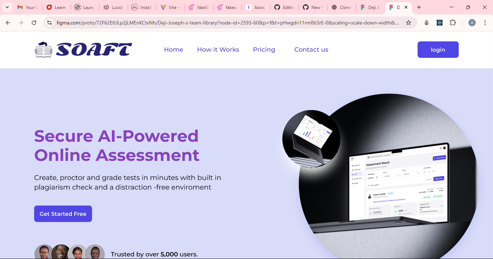
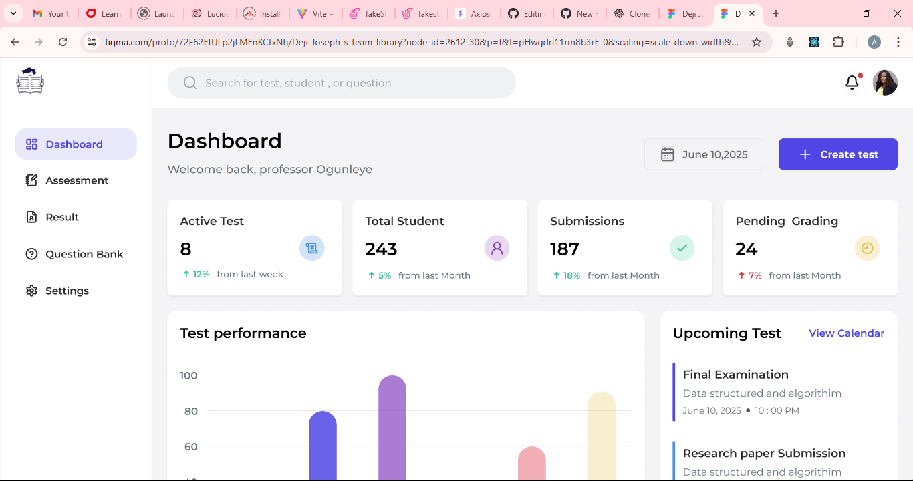
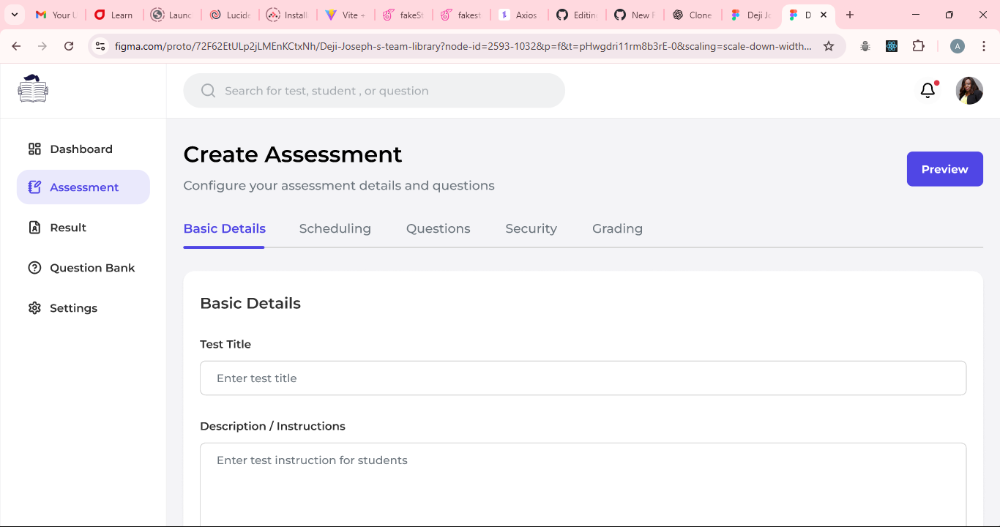
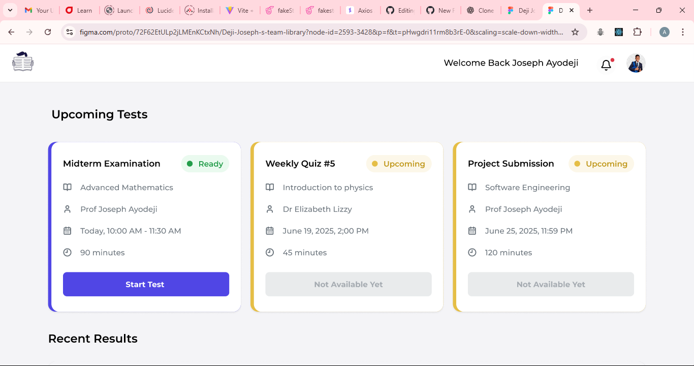

# Secure Online Assessment & Feedback Tool (SOAFT) 🚀

[](https://reactjs.org/)
[](https://tailwindcss.com/)

**SOAFT** is a secure online assessment platform designed to help educators create, deliver, and grade tests with built-in academic integrity protection. This MVP addresses key challenges in online education: cheating prevention, automated grading, and instant feedback.



---
## 🎯 Objective
- Provide a more reliable and secure way for educators to assess students online.
- Prevent academic dishonesty with anti-cheating technologies.
- Deliver instant, automated grading and feedback using AI.
- Make test-taking easier and less stressful for students, especially in low-bandwidth environments.

---

## ✨ Features

### For Educators
- 🏗 Intuitive test creation with multiple question types
- 🤖 AI-assisted grading for objective questions
- 🔍 Built-in plagiarism detection
- 📊 Performance analytics dashboard
- 🗃 Question bank management

### For Students
- 🛡 Secure, distraction-free test environment
- ⏱ Real-time timer and progress tracking
- 📝 Instant results with detailed feedback

### Security Features
- 🔒 Fullscreen lockdown mode
- 🚫 Tab switching prevention
- 📋 Copy/paste disabling
- 🌐 IP/session tracking
- 🔄 Question randomization

---

## 🛠 Tech Stack

**Frontend:**
- React.js
- TailwindCSS
- React Router
- React Icons


---

## 🚀 Getting Started

### Prerequisites
- Node.js (v16+)
- npm (v8+)

### Installation

```bash
# 1. Clone the repository
git clone https://github.com/your-username/SOAFT.git

# 2. Navigate into the project folder
cd SOAFT

# 3. Install dependencies
npm install

# 4. Start the development server
npm run dev

src/
├── components/       # Reusable UI components
│   ├── common/       # Shared components
│   ├── educator/     # Educator-specific components
│   └── student/      # Student-specific components
├── pages/            # Application screens
│   ├── auth/         # Authentication pages
│   ├── dashboard/    # Dashboard pages
│   ├── assessment/   # Assessment-related pages
│   └── results/      # Results and analytics
├── context/          # React context providers
├── services/         # API services
├── utils/            # Helper functions
├── assets/           # Static assets
│   ├── images/       # Image assets
│   └── styles/       # Global styles
├── App.js            # Main application component
└── index.js          # Application entry point
```

---
## 📸 Screenshots

| Educator Dashboard                                                | Test Creation                                                | Student View                                               |
| ----------------------------------------------------------------- | ------------------------------------------------------------ | ---------------------------------------------------------- |
|  |  |  |


# 🤝 Contributing
We welcome contributions from the community! Here's how you can help:

1. Fork the project
2. Create your feature branch: `git checkout -b feature/AmazingFeature`
3. Commit your changes: `git commit -m "Add some AmazingFeature"`
4. Push to the branch: `git push origin feature/AmazingFeature`
5. Open a Pull Request
Please read our Contribution Guidelines for details.

## 📄 License
This project is licensed under the [MIT License](LICENSE).

# 🙏 Acknowledgments
- 👩‍🏫 **Mentors:** Sarah Ibeji (Lead), Okpanachi Joseph
- 👥 **Product Managers:** Eremi Rekpene, Abimbola Soneye, Rabiat Oseni
- 💻 **Developers:** Jimba Abdullahi and Joshua Dodo
- 💡 Internship Team 134
- 🌍 Open source community for invaluable tools and resources

SOAFT - Making online assessments secure, efficient, and meaningful for educators and students worldwide. ✨
---
